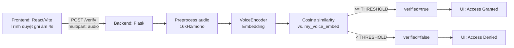

<div align="center">

# Voice Verification Smart Home (RNN-Speech Recognition)

Nhận diện **người nói** (speaker verification) theo phong cách “smart home security”: trình duyệt ghi âm → Backend trích xuất embedding giọng nói → so sánh cosine similarity → trả về `verified` + `score`.

[](https://www.python.org/)
[](https://flask.palletsprojects.com/)
[](https://react.dev/)
[](https://vite.dev/)
[](https://tailwindcss.com/)

</div>

---

## Mục tiêu

- Xác thực giọng nói “chủ nhà” dựa trên **speaker embedding** (Resemblyzer `VoiceEncoder`).
- Trả về **điểm tương đồng** (cosine similarity) và quyết định `verified` theo ngưỡng `THRESHOLD`.
- Frontend mô phỏng bảng điều khiển nhà thông minh: chỉ mở cửa / bật đèn khi đã xác thực.

---

## Demo luồng hoạt động (tổng quan)



---

## Cấu trúc thư mục

- `Backend/`
  - `Train.py`: Flask API `/verify` (xác thực thật bằng Resemblyzer)
  - `app.py`: Flask API `/verify` (giả lập ngẫu nhiên để test UI nhanh)
  - `predict.py`: chạy local, ghi âm mic → tính similarity → in kết quả
  - `convert_voice.py`: chuẩn hoá audio (mono/16kHz/16-bit) bằng pydub
- `Data/`
  - `my_voice/`: giọng “chủ nhà” dùng để enroll (tính trung bình embedding)
  - `dataset_kaggle/`: dữ liệu tham khảo nhiều người (Nguoi1..Nguoi5, other)
- `Fontend/smart_home_web/`
  - React + Vite + Tailwind UI “JARVIS HOME AI”

---

## Chạy nhanh (Windows)

### 1) Backend (API xác thực giọng nói)

> API mặc định chạy tại `http://localhost:5000`.

Tạo môi trường và cài gói (gợi ý):

```bash
python -m venv .venv
.venv\Scripts\activate
pip install -U pip
pip install flask flask-cors numpy resemblyzer soundfile
```

Chạy API “xác thực thật”:

```bash
python Backend\Train.py
```

Nếu chỉ muốn demo UI (không cần AI), chạy bản mock:

```bash
python Backend\app.py
```

### 2) Frontend (UI)

```bash
cd Fontend\smart_home_web
npm install
npm run dev
```

Mở URL Vite in ra trong terminal (thường là `http://localhost:5173`).

---

## API

### `POST /verify`

- Content-Type: `multipart/form-data`
- Field: `audio` (file)
- Response (JSON):

```json
{ "verified": true, "score": 0.8123 }
```

`score` là cosine similarity:

$$
\text{score} = \frac{\langle e_{my}, e_{test} \rangle}{\|e_{my}\|\,\|e_{test}\|}
$$

Ngưỡng hiện tại: `THRESHOLD = 0.78`.

---

## Enroll giọng “chủ nhà” (my_voice)

Backend sẽ đọc các file trong thư mục `Data/my_voice/`, trích embedding từng file, rồi lấy **trung bình**:

- Input: nhiều file `.wav`
- Output: `my_voice_embed = mean(embeds)`

Gợi ý chuẩn dữ liệu:
- 16kHz, mono
- 2–5 giây/đoạn
- Nhiều đoạn ở môi trường khác nhau để tăng độ ổn định

---

## Script tiện ích

<details>
<summary><b>convert_voice.py (chuẩn hoá audio)</b></summary>

Chạy để convert `.wav/.mp3/.m4a` → `_fixed.wav` theo chuẩn mono/16kHz/16-bit.

```bash
pip install pydub
python Backend\convert_voice.py
```

Lưu ý: pydub thường cần `ffmpeg` trong PATH để đọc/ghi một số định dạng.

</details>

<details>
<summary><b>predict.py (test nhanh bằng microphone)</b></summary>

Ghi âm mic 4 giây và tự verify tại máy:

```bash
pip install sounddevice soundfile
python Backend\predict.py
```

Lưu ý: `sounddevice` có thể cần cấu hình driver/PortAudio tuỳ máy.

</details>

---

## Ghi chú quan trọng (để chạy trơn tru)

- **Đường dẫn dữ liệu đang hard-code** trong `Backend/Train.py` và `Backend/predict.py` (`MY_FOLDER = r"E:\..."`). Nếu chạy trong repo này, hãy sửa `MY_FOLDER` trỏ về `Data\\my_voice` (đường dẫn tuyệt đối hoặc tương đối tuỳ cách chạy).
- Frontend hiện ghi âm dạng `audio/webm` và gửi lên API. Trong khi `Train.py` xử lý tốt nhất với `.wav`. Nếu API báo lỗi decode/không ra kết quả, bạn cần bước chuyển đổi (webm → wav) hoặc đổi cách ghi âm/định dạng.
- `Backend/app.py` là bản **mock** (random True/False) để test giao diện, không phản ánh model.

---

## Công nghệ sử dụng

- Backend: Flask + Flask-CORS
- Voice model: Resemblyzer `VoiceEncoder` (speaker embedding)
- Frontend: React + Vite + TailwindCSS + lucide-react

---

## Tác giả / ghi công

Dự án học tập về xác thực giọng nói và tích hợp UI smart home.
